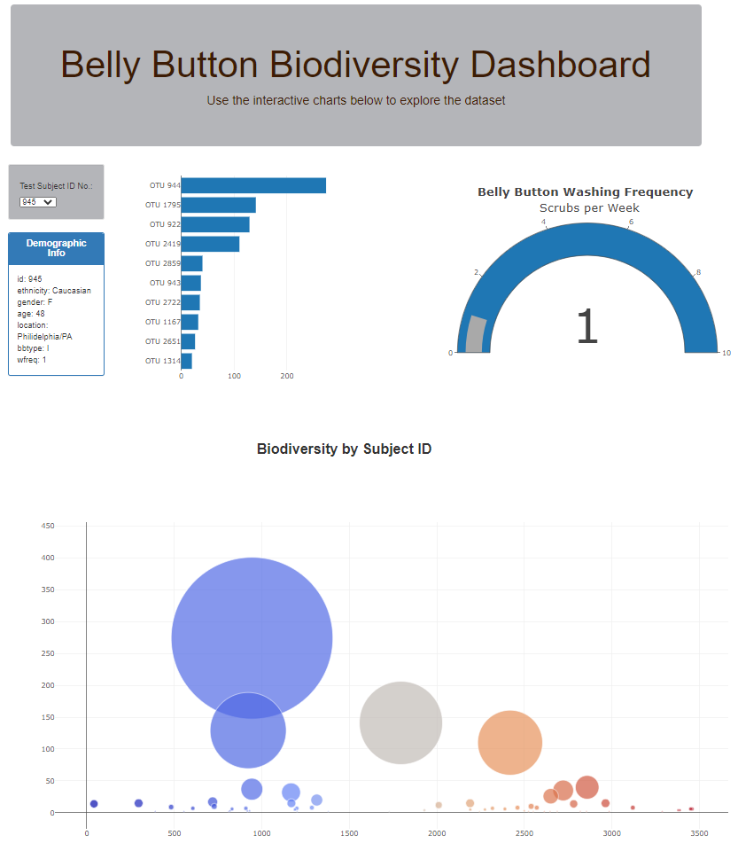

# Interactive-Web-Visualization

## Belly Button Biodiversity

 In the following exhibit we used the [Belly Button Biodiversity dataset](http://robdunnlab.com/projects/belly-button-biodiversity/) to build an interactive dashboard to explore and document a variety of microbes that colonize human navels.

The dataset reveals that a small handful of microbial species (also called operational taxonomic units, or OTUs, in the study) were present in more than 70% of people, while the rest were relatively rare.

## Plotly 

### 1. Initialization

 We used the D3 library to read in `samples.json`and setup the intitial screen display. The first subject ID data found in `sample.json` was retrieved for this initial display. The dropdown is filled by using function initDropDown.

### 2. Panel Info and Metadata 

The metadata about each subject are displayed using function fillPanel. For each subject ID is retrieved data as id, ethnicity, gender, age, location, belly button type and washing frequency.  

### 3. Bar Graph 

Next the horizontal bar graph for selected subject with top ten OTUs is created using barGraph function. When the subject selection is changed, bar graph will be redrawn using  reDrawBar function.

### 4. Bubble Graph

In bubble chart is displayed biodiversity of microbial species (OTU) found in each sample. Each bubble represents OTU by ID, with labels with species identification. The size of the bubble displays the sample value, and the color identify OTUs. 
The function BubbleGraph works to display biodiversity for the selected subject ID.

### 5. Gauge Chart

The washing frequency (scrubs per week) for selected subject ID is showcased using the gauge chart, implemented in the function gaugeBar. 

[Belly Button Biodiversity Website](https://dasasimo.github.io/Interactive-Web-Visualization/Biodiversity/index.html)

